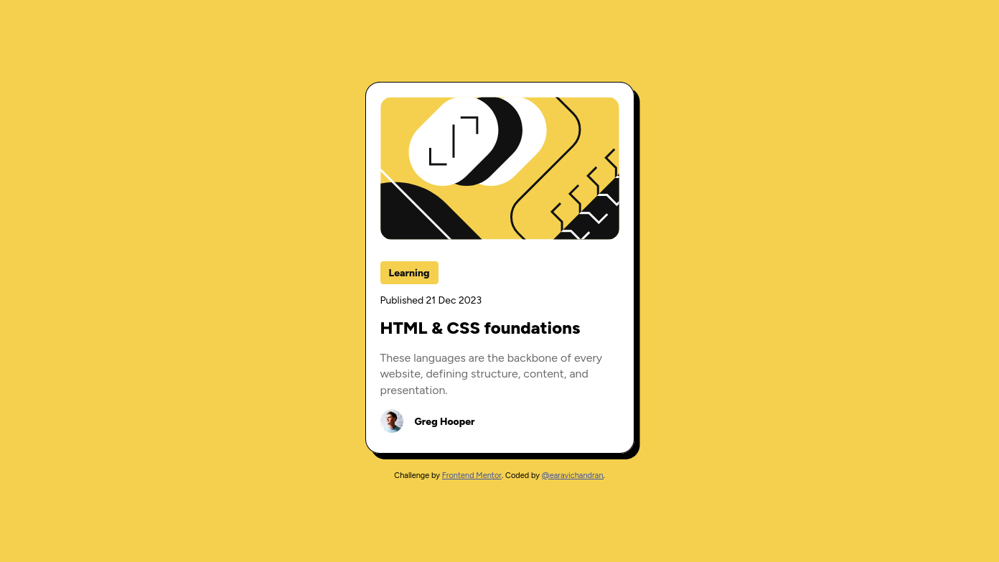
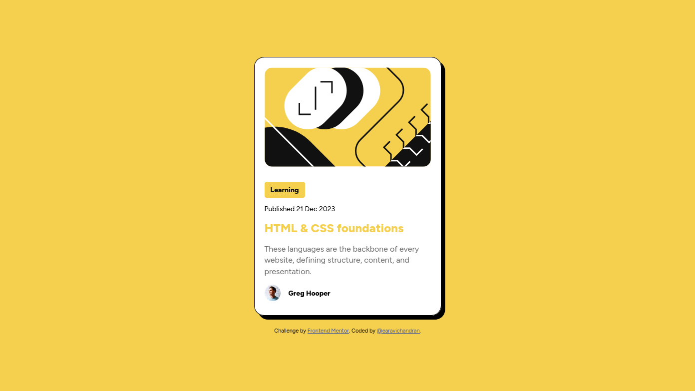
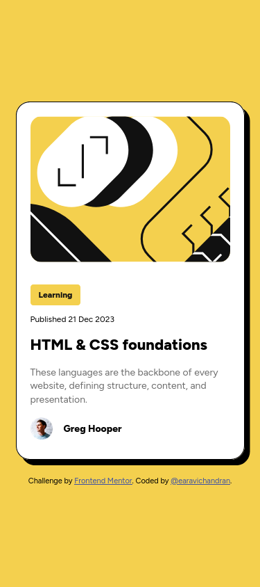

# Frontend Mentor - Blog preview card solution

This is a solution to the [Blog preview card challenge on Frontend Mentor](https://www.frontendmentor.io/challenges/blog-preview-card-ckPaj01IcS). Frontend Mentor challenges help you improve your coding skills by building realistic projects.

## Table of contents

- [Overview](#overview)
  - [The challenge](#the-challenge)
  - [Screenshot](#screenshot)
  - [Links](#links)
- [My process](#my-process)
  - [Built with](#built-with)
  - [What I learned](#what-i-learned)
- [Author](#author)
- [Acknowledgments](#acknowledgments)

## Overview

### The challenge

Users should be able to:

- See hover and focus states for all interactive elements on the page

### Screenshot





### Links

- Solution URL: [Blog preview card challenge-Github](https://github.com/earavichandran/blog-preview-card-main)
- Live Site URL: [Blog preview card challenge](https://blog-preview-card-main-nine-iota.vercel.app/)

## My process

### Built with

- Semantic HTML5 markup
- CSS custom properties
- Flexbox

### What I learned

Using this challenge, I learned how to center a card and flexbox properties.

```html
<body>
  <main>
    <section>
      <picture>
        
      </picture>
      <p class="tag">Learning</p>
      <p class="published_date">Published 21 Dec 2023</p>
      <h1>HTML & CSS foundations</h1>
      <p class="content">
        These languages are the backbone of every website, defining structure,
        content, and presentation.
      </p>
      <div class="author">
        
        <p class="author_name">Greg Hooper</p>
      </div>
    </section>
  </main>

  <footer class="attribution">
    Challenge by
    <a href="https://www.frontendmentor.io?ref=challenge">Frontend Mentor</a>.
    Coded by <a href="https://github.com/earavichandran">@earavichandran</a>.
  </footer>
</body>
```

```css
*,
*::before,
*::after {
  margin: 0;
  padding: 0;
  box-sizing: border-box;
}

:root {
  --color-yellow: hsl(47, 88%, 63%);
  --color-dark: hsl(0, 0%, 7%);
  --color-grey: hsl(0, 0%, 42%);
  --color-white: hsl(0, 0%, 100%);

  --ff-primary: "Figtree", san-serif;

  --fw-regular: 500;
  --fw-bold: 800;

  --fs-12: 0.75rem;
  --fs-14: 0.875rem;
  --fs-16: 1rem;
  --fs-18: 1.125rem;
  --fs-20: 1.25rem;
  --fs-22: 1.375rem;
  --fs-24: 1.5rem;
}

body {
  font-family: var(--ff-primary);
  background-color: var(--color-yellow);
  min-height: 100vh;

  display: flex;
  flex-direction: column;
  justify-content: center;
  align-items: center;
}

section {
  width: 375px;
  background-color: var(--color-white);
  padding: 1.25rem;
  border-radius: 1.25rem;
  border: 1px solid black;
  box-shadow: 8px 8px black;
}

.illustration-article {
  width: 100%;
  border-radius: 1rem;
  margin-bottom: 2rem;
}
.tag {
  display: inline;
  padding: 0.5rem 0.75rem;
  border-radius: 0.25rem;
  background-color: var(--color-yellow);
  color: var(--color-dark);
  font-weight: var(--fw-bold);
  font-size: var(--fs-14);
}
.published_date {
  margin-top: 1.25rem;
  font-size: var(--fs-14);
}

h1 {
  margin-top: 1rem;
  font-size: var(--fs-24);
  font-weight: var(--fw-bold);
  cursor: pointer;
}
h1:hover {
  color: var(--color-yellow);
}

.content {
  margin-top: 1rem;
  font-size: var(--fs-16);
  color: var(--color-grey);
  line-height: 1.4;
}

.author {
  display: flex;
  gap: 1rem;
  align-items: center;
  margin: 1rem 0 0.5rem 0;
}
.image-avatar {
  width: 2rem;
}
.author_name {
  font-size: var(--fs-14);
  font-weight: var(--fw-bold);
}

@media (max-width: 375px) {
  section {
    width: 330px;
  }
  .illustration-article {
    width: 100%;
    height: 210px;
    object-fit: cover;
  }

  .tag {
    font-size: var(--fs-12);
  }
  .published_date {
    font-size: var(--fs-12);
  }
  h1 {
    font-size: var(--fs-22);
  }
  .content {
    font-size: var(--fs-14);
  }
}
.attribution {
  margin-top: 1.5rem;
  font-size: 0.6875rem;
  text-align: center;
}
.attribution a {
  color: hsl(228, 45%, 44%);
}
```

If you want more help with writing markdown, we'd recommend checking out [The Markdown Guide](https://www.markdownguide.org/) to learn more.

## Author

- Frontend Mentor - [@earavichandran](https://www.frontendmentor.io/profile/earavichandran)
- Github - [@earavichandran](https://github.com/earavichandran)

## Acknowledgments

I thank the frontend mentor for creating this challenge. I thank Brad Travesy, Jonas Schmedtmann, Kevin Powel, Colt Steele for their excellent courses in Udemy and Youtube. I learned lot from them.
